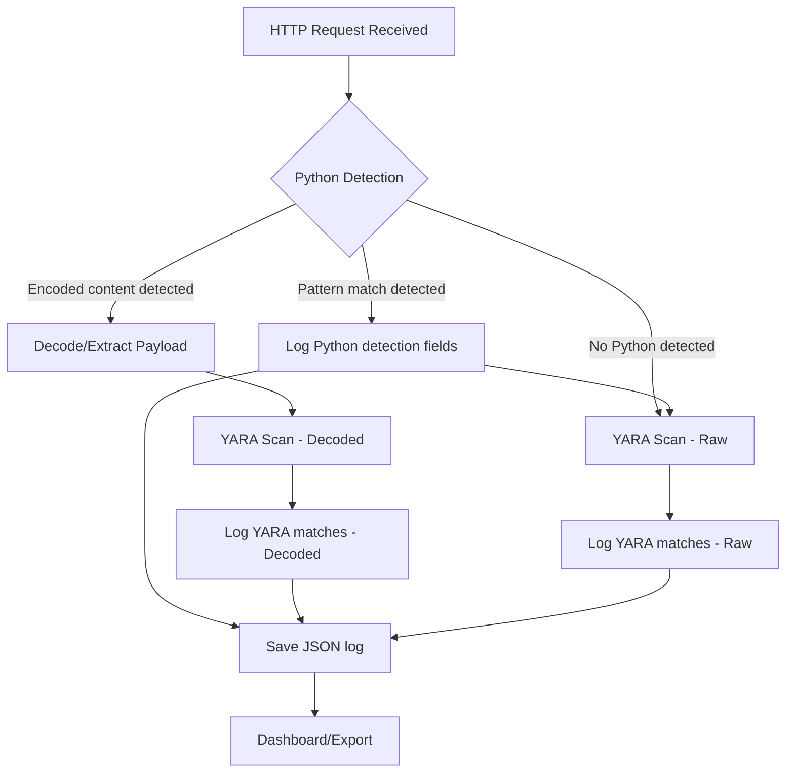

# ToolShell-Honeypot (SharePoint Zero-Day)

A Docker-based honeypot simulating a Microsoft IIS server vulnerable to ToolShell/SharePoint zero-day exploits. Detects, logs, and analyzes exploitation attempts, including advanced obfuscation and webshell delivery techniques.

## Main Features
- Logs all HTTP requests (GET, POST, etc.)
- Emulates IIS headers and key SharePoint endpoints
- IOC tagging and YARA-based detection (including obfuscation)
- HTTPS with self-signed certificate
- Streamlit dashboard for visualization and export
- Modular, Docker-based architecture

## Architecture
```
Docker Compose
├── honeypot (Flask, port 443, /data)
└── dashboard (Streamlit, port 8501, /data)
```

## Detection Pipeline


*Detection pipeline: Python logic and YARA scanning for both raw and decoded payloads. All results are logged and visualized in the dashboard.*

- **Python Detection:** Uses regex, heuristics, and custom logic to detect suspicious PowerShell, webshell, 
and exploit patterns, including obfuscation (concatenation, char codes, variable indirection, base64, etc.).
- **YARA Scan:** Applies YARA rules to both raw and decoded payloads for known exploit/webshell/obfuscation 
signatures.
- **Complementary:** Python detection can catch advanced, dynamic, or obfuscated patterns that YARA alone may 
miss; YARA provides standardized, portable detection for known threats.


### IOC and Detection Matrix
| Attack/IOC/Use Case                        | Python | YARA | Both |
|--------------------------------------------|:------:|:----:|:----:|
| ToolPane exploit endpoint                  |   X    |      |      |
| DisplayMode=Edit param                     |   X    |      |      |
| a=/ToolPane.aspx param                     |   X    |      |      |
| Referer SignOut.aspx                       |   X    |      |      |
| Suspicious User-Agent                      |   X    |      |      |
| Webshell probe endpoints                   |   X    |      |      |
| ViewState payload                          |   X    |  X   |  X   |
| Generic ASPX webshell                      |        |  X   |      |
| ToolShell/SharePoint exploit (ysoserial)   |        |  X   |      |
| PowerShell -EncodedCommand                 |   X    |  X   |  X   |
| PowerShell base64 (UTF-8/UTF-16LE)         |   X    |  X   |  X   |
| PowerShell concatenation ("I"+"EX")        |   X    |  X   |  X   |
| PowerShell char codes ([char]73+...)       |   X    |  X   |  X   |
| PowerShell variable indirection ($a='IEX') |   X    |  X   |  X   |
| PowerShell pipeline (IEX (Get-Content ...))|   X    |  X   |  X   |
| Invoke-Obfuscation artifacts               |   X    |  X   |  X   |
| Suspicious long base64                     |   X    |  X   |  X   |
| NOP sled, PE upload                        |        |  X   |      |

## Monitored Endpoints and Patterns
- `/` (catch-all)
- `/favicon.ico`
- `/_layouts/SignOut.aspx`
- `/_layouts/15/ToolPane.aspx` and `/_layouts/16/ToolPane.aspx` (POST/GET, parameters DisplayMode=Edit, a=/
ToolPane.aspx)
- `/_layouts/15/spinstall0.aspx`, `/_layouts/16/spinstall0.aspx`, `spinstall.aspx`, `spinstall1.aspx`, `info3.aspx`, `xxx.aspx`

## Indicators of Compromise (IOC)
- ToolPane exploit endpoint (with suspicious params)
- DisplayMode=Edit param
- a=/ToolPane.aspx param
- Referer SignOut.aspx
- Suspicious User-Agent (e.g., Firefox/120.0)
- Webshell probe endpoints
- ViewState payload in POST body

*All detected IOCs are shown as badges in the dashboard and can be used to filter requests.*

## YARA Rules and Advanced Detection
- Detects known exploits, webshells, PowerShell encoded/obfuscated payloads, and suspicious binaries
- Rules are applied to both raw and decoded (base64, UTF-16LE) payloads
- Easily extensible for new threats

## Data Collected and Displayed
- Request metadata: method, path, IP, headers, query args, IOC tags, YARA matches, PowerShell patterns
- POST bodies: saved as .bin files, archived daily in ZIP
- Logs: JSON per request, Apache-style access.log
- Dashboard: filter/search, download bodies/logs, CSV export, IOC/YARA highlighting

## Quick Start
1. Generate a self-signed certificate:
   ```bash
   openssl req -x509 -nodes -days 365 \
     -newkey rsa:2048 -keyout key.pem -out cert.pem \
     -subj "/CN=sharepoint.local"
   cp cert.pem key.pem ToolShell-Honeypot/
   ```
2. Build and start:
   ```bash
   cd ToolShell-Honeypot
   docker-compose build
   docker-compose up
   ```
3. Test the honeypot:
   ```bash
   # Run the basic endpoint test script
   ./test_toolshell.sh

   # Run the body content test script (covers text, JSON, XML, form, binary, and IOC cases)
   ./test_toolshell_bodies.sh

   # Run the advanced YARA/PowerShell test script
   ./test_toolshell_yara.sh
   ```
   These scripts will send a variety of requests to the honeypot, simulating real-world attack and probe scenarios. After running them, check the dashboard at http://localhost:8501 to review the results, IOC detection, and data previews.

## Service Management (manage.sh)
A management script is provided for easy control of the honeypot and dashboard services.

**Usage:**
```bash
cd ToolShell-Honeypot
chmod +x manage.sh   # (first time only)
./manage.sh
```

**Menu options:**
- 0: Build all Docker images
- 1: Start only the honeypot
- 2: Start only the dashboard
- 3: Start both honeypot and dashboard
- 4: Show status
- 5: Stop only the honeypot
- 6: Stop only the dashboard
- 7: Stop all containers
- q: Quit


## Notes
- Data is saved in ./data
- ZIP archives are rotated daily (YYYY-MM-DD.zip)
- Dashboard and honeypot are separated for security
- access.log is SIEM-compatible

## Threat Intelligence and Detection Logic
The IOC patterns, YARA rules, and detection logic are based on real-world attack campaigns and public threat intelligence for ToolShell/SharePoint vulnerabilities, including:
- Exploit attempts on ToolPane.aspx endpoints with specific parameters
- Use of known malicious Referer and User-Agent headers
- Probing of webshell endpoints
- Detection of ViewState payloads in POST bodies
- Advanced PowerShell obfuscation and webshell delivery techniques

**Relevant CVEs:**
- [CVE-2025-49704](https://www.cve.org/CVERecord?id=CVE-2025-49704): Improper code generation control (code injection) in SharePoint
- [CVE-2025-49706](https://www.cve.org/CVERecord?id=CVE-2025-49706): Improper authentication in SharePoint
- [CVE-2025-53770](https://www.cve.org/CVERecord?id=CVE-2025-53770): Deserialization of untrusted data in SharePoint
- [CVE-2025-53771](https://msrc.microsoft.com/update-guide/vulnerability/CVE-2025-53771): Path traversal in SharePoint


## TODO
- Webhook alerting, advanced parsing, SIEM integration, dashboard authentication... 