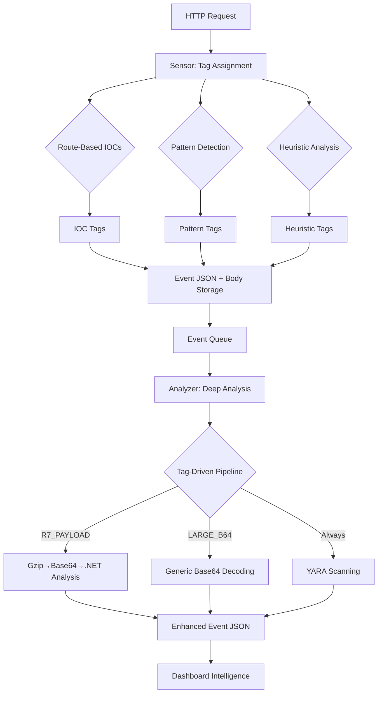

# ToolShell-Honeypot (SharePoint Zero-Day) - v2.0

A Docker-based honeypot focused on detecting and logging exploitation attempts against Microsoft SharePoint zero-day vulnerabilities.  
**Enhanced v2.0: Advanced Sensor+Analyzer architecture with comprehensive R7 Metasploit exploit analysis and sub-100ms response times.**

**This honeypot is designed for early detection and threat intelligence, not for simulating a full SharePoint environment or post-exploitation activity.**

## Main Features
- **Advanced tag-based detection** (IOC, Pattern, Heuristic categories)
- **R7 Metasploit exploit analysis** with complete payload decompression  
- **Sub-100ms response times** via asynchronous Sensor+Analyzer architecture
- YARA-based detection on raw **and decompressed** payloads
- Logs all HTTP requests with enhanced analysis and IIS header emulation
- **Intelligence dashboard** with real-time analytics and tag filtering
- HTTPS with self-signed certificate
- Modular 3-service Docker architecture

## Coverage and Limitations

**What this honeypot does:**
- Detects and logs exploit attempts targeting known SharePoint vulnerabilities ([CVE-2025-49704](https://www.cve.org/CVERecord?id=CVE-2025-49704), [CVE-2025-49706](https://www.cve.org/CVERecord?id=CVE-2025-49706), [CVE-2025-53770](https://www.cve.org/CVERecord?id=CVE-2025-53770), [CVE-2025-53771](https://msrc.microsoft.com/update-guide/vulnerability/CVE-2025-53771))
- Captures payloads, including webshells, encoded commands, and obfuscated content
- Provides IOC and YARA-based detection for threat intelligence and research

**What this honeypot does NOT do:**
- Does **not** simulate full SharePoint authentication, session management, or dynamic content
- Does **not** allow post-exploitation interaction (e.g., webshell command execution, file download/upload, lateral movement)
- Attackers may quickly realize the system is a honeypot after the initial response

## Architecture v2.0

**Sensor + Analyzer Architecture** - Separates fast request capture from deep analysis.

```
Docker Compose
├── honeypot (Sensor - HTTP capture, port 443, <100ms response)
├── analyzer (Deep analysis engine, tag-driven processing)  
└── dashboard (Intelligence dashboard, port 8501)
```

### Data Flow
```
HTTP Request → Sensor → Event Queue → Analyzer → Dashboard
             ↓          ↓             ↓
       Fast Response  SHA256 Body   Deep Analysis
       Tag Assignment Raw Storage   YARA + R7
```

**Key Improvements:**
- Asynchronous processing (responses never blocked by analysis)
- Tag-driven pipeline (IOC/Pattern/Heuristic classification)
- Complete R7 exploit analysis (Gzip→Base64→.NET decompression)
- SHA256-based body deduplication

## Enhanced Detection Pipeline v2.0



### Tag Categories
- **IOC Tags**: High-confidence indicators (IOC:ENDPOINT_TOOLPANE, IOC:CVE_2025_53771)
- **Pattern Tags**: Known exploit signatures (PATTERN:R7_PAYLOAD, PATTERN:YSOSERIAL)  
- **Heuristic Tags**: Anomaly detection (HEURISTIC:LARGE_B64, HEURISTIC:UNUSUAL_METHOD)

## Available Tags Reference

### 🔴 IOC Tags (High Risk Indicators)
*High-confidence compromise indicators with immediate alert priority*

**Endpoint-based IOCs:**
- `IOC:ENDPOINT_TOOLPANE` - Access to /_layouts/15|16/ToolPane.aspx
- `IOC:ENDPOINT_SIGNOUT` - Access to /_layouts/SignOut.aspx
- `IOC:ENDPOINT_FAVICON` - Access to /favicon.ico
- `IOC:ENDPOINT_ACLEDITOR` - Access to /_controltemplates/15|16/AclEditor.ascx
- `IOC:ENDPOINT_LAYOUTS_ASPX` - Generic /_layouts/*.aspx endpoint access
- `IOC:WEBSHELL_PROBE` - Webshell probe endpoint detection

**CVE-Specific IOCs:**
- `IOC:CVE_2025_53771` - Trailing slash authentication bypass (CVE-2025-53771)

**Parameter-based IOCs:**
- `IOC:PARAM_DISPLAYMODE_EDIT` - DisplayMode=Edit parameter detected
- `IOC:PARAM_TOOLPANE_REFERENCE` - Parameter value referencing ToolPane

**Header-based IOCs:**
- `IOC:REFERER_SIGNOUT` - Referer header contains SignOut.aspx
- `IOC:SUSPICIOUS_USER_AGENT` - Suspicious User-Agent pattern (e.g., Firefox/120.0)

### 🟠 Pattern Tags (Known Exploits)
*Signatures of known exploit frameworks and payload patterns*

**Exploit Signatures:**
- `PATTERN:R7_PAYLOAD` - Metasploit R7 exploit (MSOTlPn_DWP + CompressedDataTable)
- `PATTERN:VIEWSTATE_EXPLOIT` - __VIEWSTATE exploitation attempt
- `PATTERN:YSOSERIAL` - Java deserialization tool (ysoserial keyword)

**Code Execution Patterns:**
- `PATTERN:POWERSHELL` - PowerShell commands/scripts detected
- `PATTERN:ASPX_WEBSHELL` - ASPX webshell upload attempts

### 🟡 Heuristic Tags (Anomaly Detection)
*Behavioral anomaly detection for unknown threats*

**Payload Anomalies:**
- `HEURISTIC:LARGE_PAYLOAD` - Payload size >1KB (1024 bytes)
- `HEURISTIC:LARGE_B64` - Base64 content >100 characters
- `HEURISTIC:MULTIPLE_B64` - Multiple Base64 strings (>3)

**Parameter Anomalies:**
- `HEURISTIC:MANY_PARAMETERS` - Excessive URL parameters (>10)
- `HEURISTIC:MISSING_CONTENT_TYPE` - POST request without Content-Type
- `HEURISTIC:MALFORMED_MULTIPART` - Malformed multipart data

**Request Anomalies:**
- `HEURISTIC:UNUSUAL_METHOD` - Unusual HTTP methods (PUT/DELETE/PATCH)
- `HEURISTIC:LONG_PATH` - Extremely long URL path (>200 characters)
- `HEURISTIC:UNKNOWN_ENDPOINT` - Unmonitored endpoint (catch-all route)

### Tag Statistics
- **Total Tags Available**: 22 unique tags across 3 categories
- **IOC Tags**: 9 high-confidence indicators  
- **Pattern Tags**: 5 known exploit signatures
- **Heuristic Tags**: 8 anomaly detection rules

### Tag Priority Matrix
- **🚨 High Priority (Immediate Alert)**: IOC:CVE_2025_53771, IOC:ENDPOINT_TOOLPANE, PATTERN:R7_PAYLOAD, PATTERN:YSOSERIAL
- **⚠️ Medium Priority (Monitor)**: IOC:WEBSHELL_PROBE, PATTERN:VIEWSTATE_EXPLOIT, PATTERN:POWERSHELL, HEURISTIC:LARGE_B64
- **ℹ️ Info Priority (Log)**: HEURISTIC:UNKNOWN_ENDPOINT, IOC:ENDPOINT_FAVICON, HEURISTIC:UNUSUAL_METHOD

**Multi-layer Detection:** IOC (route-based), Pattern (exploit signatures), and Heuristic (anomaly) detection
- **R7 Exploit Analysis:** Complete Metasploit payload analysis with Gzip decompression and .NET gadget extraction
- **Enhanced YARA:** Scanning on both raw and decompressed payloads for comprehensive threat detection
- **Performance:** Sub-100ms response times with asynchronous analysis pipeline


### IOC and Detection Matrix v2.0
| Attack/IOC/Use Case                        | Tag Category | Detection Method |
|--------------------------------------------|:------------:|:----------------:|
| ToolPane exploit endpoint                  | IOC | Route-based (includes CVE-2025-53771 trailing slash) |
| DisplayMode=Edit param                     | IOC | Parameter analysis |
| Referer SignOut.aspx                       | IOC | Header analysis |
| **R7 Metasploit exploit**                  | **PATTERN** | **MSOTlPn_DWP + complete payload decompression** |
| ViewState payload                          | PATTERN | Body analysis + YARA |
| ASPX webshell                              | PATTERN | YARA rules on raw + decoded content |
| **Large Base64 content**                   | **HEURISTIC** | **Size + pattern analysis** |
| **Unusual HTTP methods**                   | **HEURISTIC** | **Method anomaly detection** |
| PowerShell obfuscation                     | PATTERN | Enhanced regex + YARA |
| PowerShell -EncodedCommand                 |   X    |  X   |  X   |
| PowerShell base64 (UTF-8/UTF-16LE)         |   X    |  X   |  X   |
| PowerShell concatenation ("I"+"EX")        |   X    |  X   |  X   |
| PowerShell char codes ([char]73+...)       |   X    |  X   |  X   |
| PowerShell variable indirection ($a='IEX') |   X    |  X   |  X   |
| PowerShell pipeline (IEX (Get-Content ...))|   X    |  X   |  X   |
| Invoke-Obfuscation artifacts               |   X    |  X   |  X   |
| Suspicious long base64                     |   X    |  X   |  X   |
| NOP sled, PE upload                        |        |  X   |      |

## Monitored Endpoints and Patterns
- `/` (catch-all)
- `/favicon.ico`
- `/_layouts/SignOut.aspx`
- `/_layouts/15/ToolPane.aspx` and `/_layouts/16/ToolPane.aspx` (POST/GET, parameters DisplayMode=Edit, a=/
ToolPane.aspx)
- `/_layouts/15/spinstall0.aspx`, `/_layouts/16/spinstall0.aspx`, `spinstall.aspx`, `spinstall1.aspx`, `info3.aspx`, `xxx.aspx`

## Indicators of Compromise (IOC)
- ToolPane exploit endpoint (with suspicious params)
- DisplayMode=Edit param
- a=/ToolPane.aspx param
- Referer SignOut.aspx
- Suspicious User-Agent (e.g., Firefox/120.0)
- Webshell probe endpoints
- ViewState payload in POST body

*All detected IOCs are shown as badges in the dashboard and can be used to filter requests.*

## YARA Rules and Advanced Detection
- Detects known exploits, webshells, PowerShell encoded/obfuscated payloads, and suspicious binaries
- Rules are applied to both raw and decoded (base64, UTF-16LE) payloads
- Easily extensible for new threats

## Data Collected and Displayed
- **Request metadata**: method, path, IP, headers, query args, enhanced tag system (IOC/Pattern/Heuristic)
- **POST bodies**: SHA256-named .bin files with deduplication (replaces daily ZIP archives)
- **Deep analysis results**: R7 payload decompression, YARA matches on raw + decoded content
- **Enhanced logs**: Event-driven JSON with sensor capture and analyzer results
- **Dashboard**: Real-time tag filtering, performance monitoring, R7 exploit alerts, intelligence export

## Quick Start

1. **Generate a self-signed certificate**:
   ```bash
   openssl req -x509 -nodes -days 365 \
     -newkey rsa:2048 -keyout key.pem -out cert.pem \
     -subj "/CN=sharepoint.local"
   cp cert.pem key.pem ToolShell-Honeypot/
   ```

2. **Build and run all services (sensor + analyzer + dashboard)**:
   ```bash
   cd ToolShell-Honeypot
   sudo docker-compose up --build
   ```
   Or use the interactive management script:
   ```bash
   ./manage.sh
   ```
   Choose option 6 to start all services, or start components individually.

3. **Test the honeypot**:
   ```bash
   # Comprehensive test suite covering all v2.0 features
   ./test_comprehensive.sh
   ```

4. **Access the dashboard**:
   Open `http://localhost:8501` to view the intelligence dashboard with:
   - Tag-based filtering (IOC, Pattern, Heuristic categories)
   - R7 exploit detection alerts with payload decompression status
   - Real-time performance metrics (response times, analysis speed)
   - Export capabilities (JSON, CSV, raw payloads)

   The test scripts simulate real-world attack scenarios. Check the dashboard to review results, IOC detection, and data analysis.

## Service Management (manage.sh)
A management script is provided for easy control of the honeypot and dashboard services.

**Usage:**
```bash
cd ToolShell-Honeypot
chmod +x manage.sh   # (first time only)
./manage.sh
```

**Menu options:**
- 0: Build all Docker images
- 1: Start only the honeypot (sensor)
- 2: Start only the analyzer
- 3: Start only the dashboard  
- 4: Start honeypot + analyzer
- 5: Start analyzer + dashboard
- 6: Start all services (honeypot + analyzer + dashboard)
- 7: Show status
- 8-11: Stop individual services
- q: Quit


## Notes
- Data is saved in ./data with structure: /raw_bodies, /events/{new,processed,error}
- SHA256-based body deduplication (replaces daily ZIP archives)
- Dashboard, honeypot (sensor), and analyzer are separated for security and performance
- access.log is SIEM-compatible with enhanced tag information
- Sub-100ms response times achieved via asynchronous processing

## Threat Intelligence and Detection Logic
The IOC patterns, YARA rules, and detection logic are based on real-world attack campaigns and public threat intelligence for ToolShell/SharePoint vulnerabilities, including:
- Exploit attempts on ToolPane.aspx endpoints with specific parameters
- Use of known malicious Referer and User-Agent headers
- Probing of webshell endpoints
- Detection of ViewState payloads in POST bodies
- Advanced PowerShell obfuscation and webshell delivery techniques

**Relevant CVEs:**
- [CVE-2025-49704](https://www.cve.org/CVERecord?id=CVE-2025-49704): Improper code generation control (code injection) in SharePoint
- [CVE-2025-49706](https://www.cve.org/CVERecord?id=CVE-2025-49706): Improper authentication in SharePoint
- [CVE-2025-53770](https://www.cve.org/CVERecord?id=CVE-2025-53770): Deserialization of untrusted data in SharePoint
- [CVE-2025-53771](https://msrc.microsoft.com/update-guide/vulnerability/CVE-2025-53771): Path traversal in SharePoint


## TODO
- Webhook alerting, advanced parsing, SIEM integration, dashboard authentication, extend honeypot capabilities to simulate authentication, session management, dynamic content, limited post-exploitation interaction (e.g., webshell command execution, file upload/download) for deeper attacker engagement and analysis and many more...