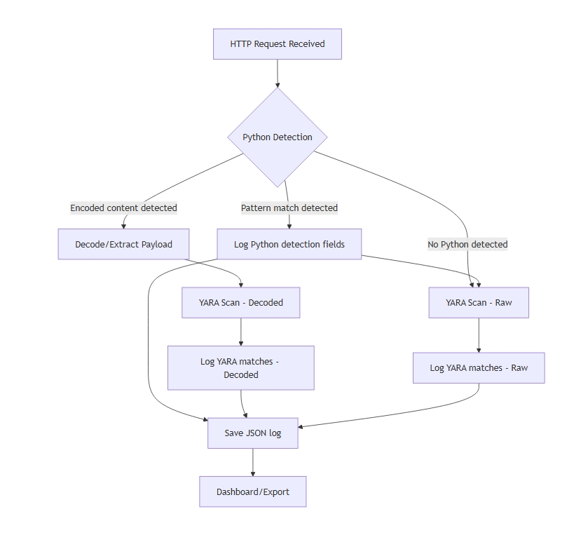

# ToolShell-Honeypot (SharePoint Zero-Day)

A Docker-based honeypot simulating a Microsoft IIS server vulnerable to ToolShell/SharePoint zero-day exploits. Designed to detect, log, and analyze exploitation attempts, including advanced obfuscation and webshell delivery techniques.

## Main Features
- Accepts and logs all HTTP requests (GET, POST, ...)
- Emulates IIS headers
- Logs requests in JSON, POST bodies in .bin, and daily ZIP archives
- HTTPS with self-signed certificate
- Streamlit dashboard for data visualization and download
- **Realistic endpoints:** catch-all + dedicated routes for endpoints used in ToolShell/SharePoint campaigns
- **IOC detection:** automatic tagging of suspicious requests based on threat intelligence indicators
- **Apache/Nginx-style access.log:** SIEM-compatible log file
- **Visual alert:** stdout alert for IOC detection
- **Daily ZIP/log rotation:** daily archives of POST bodies
- **Dashboard features:** summary table with Time, Method, Path, IP, IOC, YARA, PowerShell/Base64; IOC filter; request details with safe body preview (hex and text); global downloads for all .bin, all JSON logs, and access.log
- **YARA integration:** advanced rules for exploit, webshell, PowerShell, and obfuscation detection
- **Advanced PowerShell detection:** identifies encoded, obfuscated, and concatenated PowerShell payloads, including base64 (UTF-8/UTF-16LE)

## Architecture
```
Docker Compose
├── honeypot (Flask, port 443, /data)
└── dashboard (Streamlit, port 8501, /data)
```

## Detection Pipeline (Python + YARA)


*Figure: End-to-end detection pipeline for HTTP requests, Python logic, and YARA scanning.*

- **Python Detection:** Uses regex, heuristics, and custom logic to detect suspicious PowerShell, webshell, and exploit patterns, including obfuscation (concatenation, char codes, variable indirection, base64, etc.).
- **YARA Scan:** Applies YARA rules to both raw and decoded payloads for known exploit/webshell/obfuscation signatures.
- **Complementary:** Python detection can catch advanced, dynamic, or obfuscated patterns that YARA alone may miss; YARA provides standardized, portable detection for known threats.

### YARA Rule Matching Flow


*Figure: The detection pipeline and YARA matching flow—raw and decoded payloads are scanned, logged, and visualized in the dashboard.*

### IOC and Detection Matrix
| Attack/IOC/Use Case                        | Python Detection | YARA Rule | Both |
|--------------------------------------------|:----------------:|:---------:|:----:|
| ToolPane exploit endpoint                  |        X         |           |      |
| DisplayMode=Edit param                     |        X         |           |      |
| a=/ToolPane.aspx param                     |        X         |           |      |
| Referer SignOut.aspx                       |        X         |           |      |
| Suspicious User-Agent                      |        X         |           |      |
| Webshell probe endpoints                   |        X         |           |      |
| ViewState payload                          |        X         |     X     |  X   |
| Generic ASPX webshell                      |                  |     X     |      |
| ToolShell/SharePoint exploit (ysoserial)   |                  |     X     |      |
| PowerShell -EncodedCommand                 |        X         |     X     |  X   |
| PowerShell base64 (UTF-8/UTF-16LE)         |        X         |     X     |  X   |
| PowerShell concatenation ("I"+"EX")        |        X         |     X     |  X   |
| PowerShell char codes ([char]73+...)       |        X         |     X     |  X   |
| PowerShell variable indirection ($a='IEX') |        X         |     X     |  X   |
| PowerShell pipeline (IEX (Get-Content ...))|        X         |     X     |  X   |
| Invoke-Obfuscation artifacts               |        X         |     X     |  X   |
| Suspicious long base64                     |        X         |     X     |  X   |
| NOP sled, PE upload                        |                  |     X     |      |

## Monitored Endpoints and Patterns
The server emulates and logs in detail:
- `/` (catch-all)
- `/favicon.ico`
- `/_layouts/SignOut.aspx`
- `/_layouts/15/ToolPane.aspx` and `/_layouts/16/ToolPane.aspx` (POST/GET, parameters DisplayMode=Edit, a=/ToolPane.aspx)
- `/_layouts/15/spinstall0.aspx`, `/_layouts/16/spinstall0.aspx`, `spinstall.aspx`, `spinstall1.aspx`, `info3.aspx`, `xxx.aspx`

## Indicators of Compromise (IOC) Detected
Each request is analyzed for the following IOCs (Indicators of Compromise):
- **ToolPane exploit endpoint:** Requests to `/ToolPane.aspx` endpoints, especially with suspicious parameters.
- **DisplayMode=Edit:** Presence of the `DisplayMode=Edit` parameter in the query string.
- **a=/ToolPane.aspx:** Presence of the `a=/ToolPane.aspx` parameter in the query string.
- **Referer SignOut.aspx:** Requests with the `Referer` header set to `/layouts/SignOut.aspx` or its variants.
- **Suspicious User-Agent:** Requests with User-Agent strings known from real-world attacks (e.g., Firefox/120.0).
- **Webshell probe:** Requests to known webshell endpoints (`spinstall0.aspx`, `spinstall.aspx`, `spinstall1.aspx`, `info3.aspx`, `xxx.aspx`).
- **ViewState payload:** POST requests containing `__VIEWSTATE` in the body.

**All detected IOCs are shown as badges in the dashboard and can be used to filter requests.**

## YARA Rules and Advanced Detection
The honeypot uses a comprehensive set of YARA rules to detect:
- ToolShell/SharePoint exploits (ViewState, ysoserial, etc.)
- Generic and specific ASPX webshells
- PowerShell encoded commands and suspicious base64
- PowerShell command concatenation (e.g. 'I'+'EX')
- Char code construction ([char]73+[char]69+[char]88)
- Variable indirection for IEX
- UTF-16LE base64 (PowerShell encoded)
- Pipeline and obfuscation artifacts (Invoke-Obfuscation, scriptblock, etc.)
- NOP sleds, PE uploads, and other binary payloads

YARA rules are applied to both the raw POST body and any decoded payloads (e.g., base64, UTF-16LE). All matches are logged and shown in the dashboard.

## Data Collected and Displayed
- **Summary Table:** Shows Time, Method, Path, IP, IOC, YARA, PowerShell/Base64 for each request.
- **Request Details:** For each request, you can view:
  - All HTTP headers
  - Query parameters
  - Remote IP address
  - IOC badges
  - YARA matches (raw and decoded)
  - PowerShell patterns detected (including obfuscation)
  - Body preview (hex for all, and as text if Content-Type is textual)
  - Download buttons for body and JSON log
- **Global Downloads:** Download all POST bodies (.bin) as a daily ZIP, all JSON logs as a ZIP, and the full access.log.
- **Access Log:** Apache/Nginx-style log, one line per request, with IOC information.

## Quick Start
1. Generate a self-signed certificate:
   ```bash
   openssl req -x509 -nodes -days 365 \
     -newkey rsa:2048 -keyout key.pem -out cert.pem \
     -subj "/CN=sharepoint.local"
   cp cert.pem key.pem ToolShell-Honeypot/
   ```
2. Build and start:
   ```bash
   cd ToolShell-Honeypot
   docker-compose build
   docker-compose up
   ```
3. Test the honeypot:
   ```bash
   # Run the basic endpoint test script
   ./test_toolshell.sh

   # Run the body content test script (covers text, JSON, XML, form, binary, and IOC cases)
   ./test_toolshell_bodies.sh

   # Run the advanced YARA/PowerShell test script
   ./test_toolshell_yara.sh
   ```
   These scripts will send a variety of requests to the honeypot, simulating real-world attack and probe scenarios. After running them, check the dashboard at http://localhost:8501 to review the results, IOC detection, and data previews.

## Notes
- Data is saved in ./data
- ZIP archives are rotated daily (YYYY-MM-DD.zip)
- Dashboard and honeypot are separated for security
- access.log is SIEM-compatible

## Threat Intelligence and Detection Logic
The IOC patterns, YARA rules, and detection logic are based on real-world attack campaigns and public threat intelligence for ToolShell/SharePoint vulnerabilities, including:
- Exploit attempts on ToolPane.aspx endpoints with specific parameters
- Use of known malicious Referer and User-Agent headers
- Probing of webshell endpoints
- Detection of ViewState payloads in POST bodies
- Advanced PowerShell obfuscation and webshell delivery techniques

## TODO
- Webhook alerting, advanced parsing, SIEM integration, dashboard authentication... 